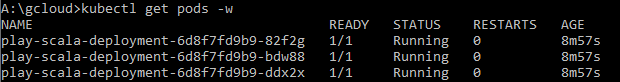

# Scala API Repo

# How to Run on Local
1. `sbt run`
2. Navigate to http://localhost:9000

# How to Run on Local with Docker
1. `docker build -t play-scala-app .`
2. `docker run -p 9000:9000 play-scala-app`
3. Navigate to http://localhost:9000

# How to Push to Google Artifact Registry
1. Authenticate with gcloud CLI
2. `docker tag play-scala-app us-central1-docker.pkg.dev/{your-project-id}/{my-repo}/play-scala-app`
3. `docker push us-central1-docker.pkg.dev/{your-project-id}/{my-repo}/play-scala-app`

# GCP Commands + Kubectl
* Applies YAML to the Auth'd Kube Instance to Deploy the App `kubectl apply -f A:\PersonalProject\scala-api\scala-api\deployment.yaml`
* `kubectl get pods -w`
